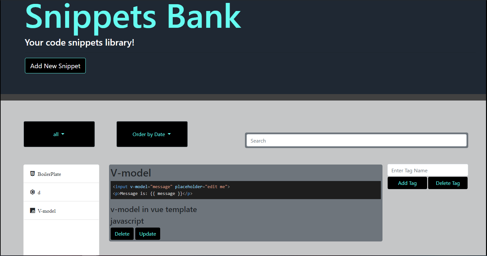

# Snippet Bank
<p>
  
  <a href="https://github.com/Ebyrd10/burgers_taskmaster#readme" target="_blank">
    
  </a>
  <a href="https://github.com/Ebyrd10/burgers_taskmaster/graphs/commit-activity" target="_blank">
    
  </a>
</p>

Snippet Bank is an application for developers to store code snippets in a centralzied location- no matter the language or type of snippet.



## Description

Users are given the ability to add, update, and delete snippets.  All snippets are made available in a list, where users can click on individual snippets to see their contents.  Users are given the option to be able to filter snippets by coding language or by their creation date.  Users also have the ability to search snippets based off their title and description.

## Installation

```sh
npm install
```

```sh
create mySQL schema using db/schema.sql
```

```sh
 Initial database values can also be provided using the db/seed.sql file.
```

```sh
node server.js
```

```sh
If choosing to run the application locally, navigate to http://localhost:8089
```

## Technology
* HTML
* CSS
* jQuery
* Bootstrap
* node.js
* express
* Handlebars
* express-handlebars
* mySQL
* Highlight.js

## Contributing

Overall team:
Kouros Mousavi, Ethan Byrd, Mason SungJin Kim, and Mariana Barnett

| **Ethan Byrd**| **Kouros Mousavi**| **Mariana Barnett**| **Mason SungJin Kim** |
| :---: |:---:| :---:| :---:|
| [](http://github.com/Ebyrd10)    | [](http://github.com/koutron)    | [](http://github.com/maribarnett3) | [](http://github.com/sungjinkimm)  |
| <a href="http://github.com/Ebyrd10" target="_blank">`github.com/Ebyrd10`</a> | <a href="http://github.com/koutron" target="_blank">`github.com/koutron`</a> | <a href="http://github.com/maribarnett3" target="_blank">`github.com/maribarnett3`</a> | <a href="http://github.com/sungjinkimm" target="_blank">`github.com/sungjinkimm`</a> |

## 🤝 Contributing

Contributions, issues and feature requests are welcome!<br />Feel free to check [issues page](https://github.com/Ebyrd10/burgers_taskmaster/issues). You can also take a look at the [contributing guide](https://github.com/Ebyrd10/burgers_taskmaster/blob/master/CONTRIBUTING.md).

## Show your support

Give a ⭐️ if this project helped you!
## Support

Reach out to me at one of the following places!

- Website at <a href="http://www.Ethanmbyrd.com" target="_blank">`Ethanmbyrd.com`</a>
- LinkdenIn at <a href="https://www.linkedin.com/in/ethan-byrd/" target="_blank">`https://www.linkedin.com/in/ethan-byrd/`</a>

---

## License

[](http://badges.mit-license.org)

- **[MIT license](http://opensource.org/licenses/mit-license.php)**


